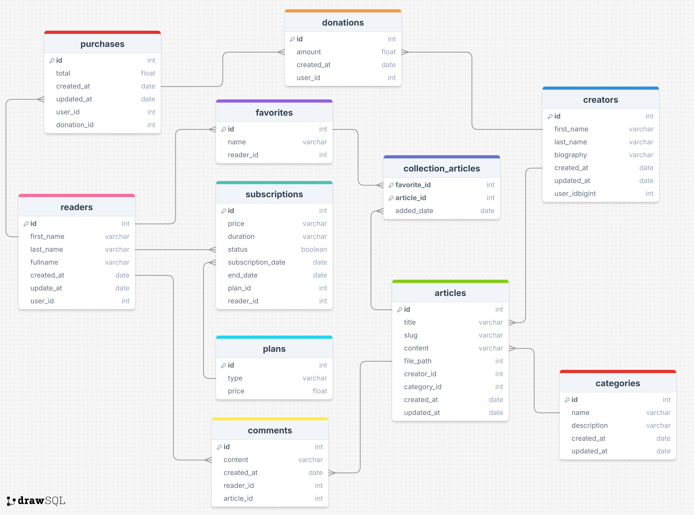

## Introducción

**ReadEDU** es una aplicación web diseñada para facilitar la publicación y monetización de artículos y contenidos educativos. Con ReadEDU, los creadores de contenido pueden crear una cuenta, iniciar sesión, y generar ingresos a través de suscripciones o donaciones de sus lectores. Los administradores de la plataforma tienen la capacidad de gestionar usuarios, publicaciones y categorías de contenido mediante operaciones CRUD (Crear, Leer, Actualizar, Eliminar). Además, la plataforma permite a los creadores organizar y gestionar sus artículos en un entorno seguro, ofreciendo una experiencia de usuario completa para la interacción con lectores.

El propósito de ReadEDU es proporcionar una plataforma integrada que permita a los creadores de contenido compartir conocimientos, monetizar su trabajo, y optimizar su alcance a través de herramientas de análisis y personalización, todo en un entorno seguro y amigable.

### Colaboradores del Proyecto

| **Nombre**                        | **Rol**                                     | **Perfil**                                                 |
|-----------------------------------|---------------------------------------------|------------------------------------------------------------|
| Gustavo Alexander Cruz León      | Líder del Proyecto | [LinkedIn]          |
| Piero Gadiel Aguirre del Castillo      | Miembro del Proyecto | [LinkedIn]          |
| Samil Grados Araujo      | Miembro del Proyecto | [LinkedIn]          |
| Jeffry Paredes Cajo      | Miembro del Proyecto | [LinkedIn]          |
| Joaquín Portella Pedemonte      | Miembro del Proyecto | [LinkedIn]          |

### Revisa el Progreso del Proyecto BookHub

| **Columna**       | **Descripción**                                                                                                                                    |
|-------------------|----------------------------------------------------------------------------------------------------------------------------------------------------|
| **Backlog**       | Contiene todas las historias de usuario, tareas y características que deben desarrollarse. Es el listado de todo el trabajo pendiente.              |
| **En Progreso**   | Incluye las tareas que están actualmente en desarrollo. Visualiza el trabajo en curso para asegurar el flujo continuo de trabajo.                   |
| **Revisión**      | Después de completar una tarea, se mueve aquí para una revisión de código y revisión por pares (peer review). Esta fase incluye la creación de **pull requests** para asegurar que el código cumpla con los estándares de calidad antes de integrarse al proyecto principal. |
| **En Pruebas**    | Contiene las tareas que han pasado la revisión de código y necesitan pruebas exhaustivas (unitarias, de integración y de aceptación) para garantizar su calidad. |
| **Hecho**         | Las tareas completamente desarrolladas, revisadas y probadas se mueven aquí, indicando que están listas y finalizadas.                               |

Mira cómo va avanzando nuestro trabajo visitando el siguiente enlace: [Tablero de Trello](https://trello.com/b/bWXFMlPt).

### Funcionalidades de la Aplicación ReadEDU

#### **Módulo de Gestión de Usuarios**

- **Creación de Usuarios e Inicio de Sesión:**
    - Permitir a los usuarios registrarse en la plataforma.
    - Facilitar el inicio de sesión para acceder a la cuenta personal.
    - Mantener la seguridad de las credenciales de los usuarios.

#### **Módulo de Creación y Publicación de Contenidos**

- **Editor de Artículos:**
    - Un editor de texto enriquecido para crear y dar formato a artículos.
    - Permite agregar imágenes, videos y enlaces, con opción de previsualización antes de la publicación.

- **Gestión de Publicaciones:**
    - Los creadores pueden publicar, editar o eliminar sus artículos.
    - Opción de programar publicaciones futuras.

#### **Módulo de Monetización**

- **Suscripciones y Donaciones:**
    - Integración con sistemas de pago como PayPal para que los creadores reciban suscripciones mensuales o donaciones únicas.
    - Monetización directa desde la plataforma.

- **Gestión de Ingresos:**
    - Un panel que permite a los creadores ver sus ganancias y realizar retiros a través de distintos métodos de pago.

#### **Módulo de Gestión de Contenido**

- **Gestión de Artículos:**
    - Añadir nuevos artículos al catálogo.
    - Editar detalles de los artículos existentes.
    - Eliminar artículos de la plataforma.
    - Listar todos los artículos disponibles para los usuarios.

- **Categorías de Contenido:**
    - Clasificar artículos en diferentes categorías.
    - Facilitar la navegación y búsqueda de artículos por categoría.
    - Mejorar la organización del catálogo de contenido.

#### **Módulo de Biblioteca Personal**

- **Biblioteca Personal de Artículos:**
    - Permitir a los creadores y lectores organizar los artículos en colecciones personalizadas.
    - Facilitar la creación, edición y eliminación de colecciones.
    - Mejorar el acceso y la gestión de las publicaciones guardadas.

#### **Módulo de Reportes**

- **Reportes de Actividad y Ganancias:**
    - Generar reportes sobre los artículos publicados y las interacciones de los lectores.
    - Mostrar estadísticas de lecturas, interacciones, suscripciones y donaciones.
    - Proveer información detallada sobre la actividad de los usuarios, como artículos más leídos o autores más populares.

## Diagramas de la Aplicación

Para entender mejor la estructura y diseño de la aplicación "ReadEDU", revisa los siguientes diagramas:

### Diagrama de Clases

### Diagrama de Base de Datos

Este diagrama ilustra el esquema de la base de datos utilizada por la aplicación, mostrando las tablas, columnas, y relaciones entre las entidades.

### Descripción de Capas del Proyecto

| capa        | descripción                                                                                  |
|-------------|----------------------------------------------------------------------------------------------|
| api         | Contiene los controladores REST que manejan las solicitudes HTTP y las respuestas.            |
| entity      | Define las entidades del modelo de datos que se mapean a las tablas de la base de datos.      |
| repository  | Proporciona la interfaz para las operaciones CRUD y la interacción con la base de datos.      |
| service     | Declara la lógica de negocio y las operaciones que se realizarán sobre las entidades.         |
| service impl| Implementa la lógica de negocio definida en los servicios, utilizando los repositorios necesarios. |

# Asignación de Historias de Usuario

### Sprint 1: Funcionalidades Básicas
Enfocado en implementar las funcionalidades esenciales de CRUD para la gestión de categorías, libros, autores, usuarios y el flujo inicial de compras, asegurando que el producto esté listo para un uso básico.

| Integrante     | Módulo                  | Historia de Usuario                                      | Descripción                                                                                                                   | Tipo   |
|----------------|-------------------------|---------------------------------------------------------|-------------------------------------------------------------------------------------------------------------------------------|--------|
| Gustavo	 | Gestión de Categorías    | Historia de Usuario 1: Crear categorías                 | Como administrador, quiero poder crear, leer, actualizar y eliminar categorías para mantener organizada la colección de libros. | CRUD   |
|                | Gestión de Libros       | Historia de Usuario 2: Crear libros                     | Como administrador, quiero poder crear, leer, actualizar y eliminar libros para mantener actualizada la oferta disponible.     | CRUD   |
| Joaquin	 | Gestión de Autores      | Historia de Usuario 3: Crear autores                    | Como administrador, quiero poder crear, leer, actualizar y eliminar información de autores para mantener actualizada la base de datos de autores. | CRUD   |
| 		 | Gestión de Usuarios      | Historia de Usuario 5: Registrar usuarios               | Como usuario, quiero poder registrarme en la plataforma para acceder a las funcionalidades disponibles.                       | CRUD   |
| Samil		 | Gestión de Usuarios      | Historia de Usuario 6: Actualizar información personal   | Como usuario, quiero poder actualizar mi información personal para mantener mis datos al día en la plataforma.                | CRUD   |
|                | Gestión de Usuarios      | Historia de Usuario 7: Ver detalles de mi perfil       | Como usuario, quiero poder ver todos los detalles de mi perfil para revisar mi información y actividad.                       | CRUD   |
| Piero		 | Gestión de Compras      | Historia de Usuario 8: Flujo inicial de compra         | Como usuario, quiero poder seleccionar libros para comprarlos, simulando el flujo de compra inicial antes de integrar pagos.   | Core   |
|  		 | Gestión de Colección    | Historia de Usuario 10: Añadir libros a la colección    | Como usuario, quiero poder añadir libros a mi colección personal para organizar mis lecturas y favoritos.                     | Core   |
| Jeffry	 | Gestión de Colección    | Historia de Usuario 11: Eliminar libros de la colección  | Como usuario, quiero poder eliminar libros de mi colección personal cuando ya no los necesite.                                 | Core   |
|                | Gestión de Colección    | Historia de Usuario 12: Ver lista de libros en colección | Como usuario, quiero ver la lista completa de libros en mi colección para gestionar mis favoritos.                            | CRUD   |